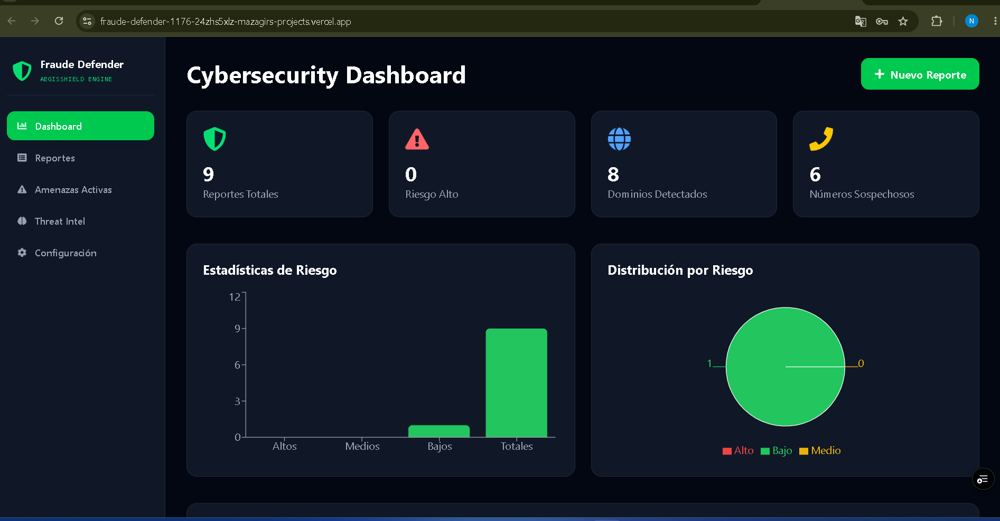
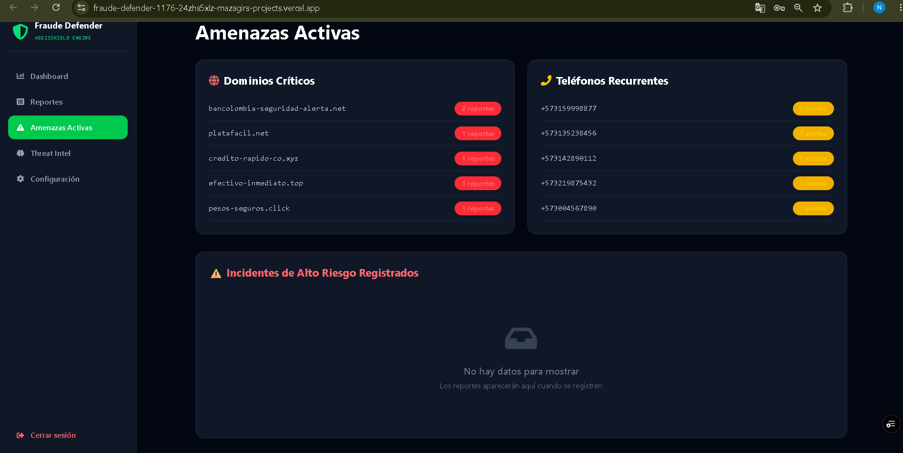

<div align="center">

# 🛡️ AegisShield | Anti-Fraud Intelligence
### *Next-Generation Threat Intelligence & Cybersecurity Platform*

[]()
[]()
[]()

**AegisShield** es una solución técnica diseñada para la detección, correlación y mitigación de infraestructura maliciosa en tiempo real. Construido para combatir el fraude financiero digital mediante análisis heurístico y automatización de procesos de seguridad (SOAR).

[🚀 Live Demo](https://fraude-defender-1176.vercel.app) | [📖 API Documentation](https://fraude-defender-api.onrender.com/docs)

</div>

---

## ⚡ Core Features
*   **Heuristic Risk Engine**: Algoritmos de scoring para clasificar la peligrosidad de dominios y números de contacto.
*   **Dynamic Telemetry**: Visualización de incidentes mediante gráficos interactivos integrados.
*   **Security First**: Arquitectura de autenticación basada en JWT y protección de endpoints críticos.
*   **Threat Intelligence**: Base de conocimiento centralizada para firmas de ataque y patrones de fraude.

---

## 🛠 Tech Stack
| Domain | Technology |
| :--- | :--- |
| **Backend** | Python 3.13, FastAPI, Uvicorn, SQLAlchemy |
| **Frontend** | React, Vite, Tailwind CSS, Recharts |
| **Database** | PostgreSQL |
| **Deployment** | Vercel (FE) & Render (BE) |

---

## 🖼️ Architecture & Workflow

*(Las capturas a continuación muestran el flujo de respuesta ante un incidente)*

| Dashboard Overview | Incident Intelligence |
| :--- | :--- |
|  |  |

---

## 🚀 Get Started
El proyecto está diseñado bajo principios de arquitectura limpia. Para ejecutar el entorno de desarrollo:

```bash
# Clone el repositorio
git clone [https://github.com/mazagir/fraude-defender.git](https://github.com/mazagir/fraude-defender.git)

# Instale dependencias del backend
cd backend && pip install -r requirements.txt

# Despliegue del entorno
uvicorn main:app --reload