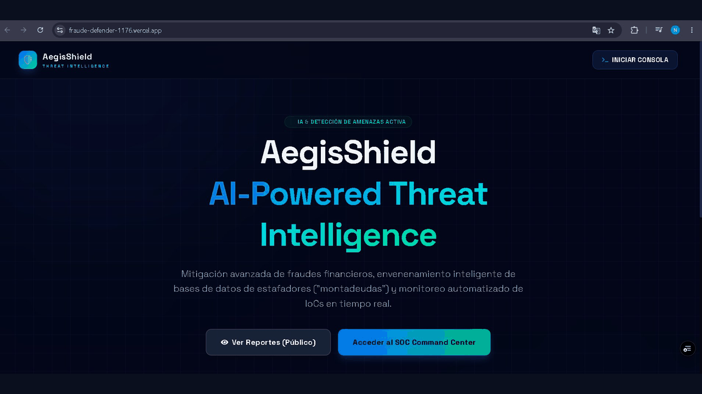
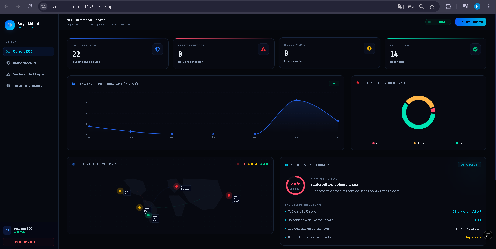
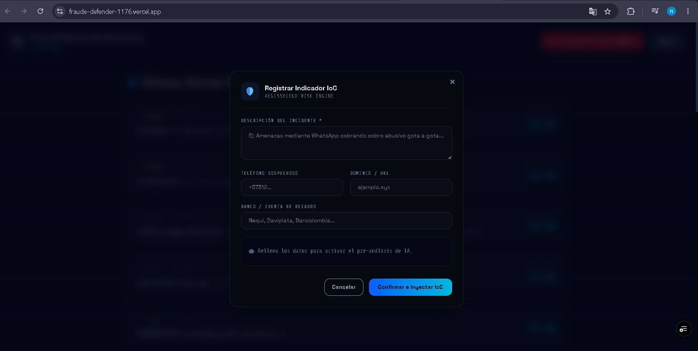

<div align="center">


# 🛡️ AegisShield | Anti-Fraud Intelligence Platform
### *Plataforma de Ciberseguridad de Próxima Generación y Mitigación de Fraude*

[]()
[]()
[]()
[]()

**AegisShield** es tu Centro de Operaciones de Seguridad (SOC) definitivo. Una solución diseñada arquitectónicamente para la detección proactiva, correlación instantánea y mitigación en tiempo real de infraestructura maliciosa (IoCs) y esquemas de fraude financiero como extorsiones y "gota a gota".

[🚀 Ver Demo en Vivo](https://fraude-defender-1176.vercel.app) | [📖 Documentación API](https://fraude-defender-api.onrender.com/docs) | [🐛 Reportar Bug](https://github.com/mazagir/fraude-defender/issues)

<br/>



</div>

<br />

> **“Defendiendo el ciberespacio financiero, un indicador de compromiso a la vez.”**

---

## 🔥 Características Principales

*   🧠 **Motor Heurístico de Riesgo impulsado por IA**: Algoritmos de scoring avanzados que clasifican automáticamente la severidad y el nivel de amenaza de dominios, cuentas bancarias y números de contacto (IoCs).
*   🌐 **Portal Público de Denuncias Anónimas**: Interfaz comunitaria segura donde los ciudadanos pueden alertar sobre fraudes sin comprometer su identidad, creando inteligencia colectiva.
*   📊 **Telemetría Dinámica en Vivo**: Consola de SOC (Command Center) con gráficos interactivos, mapas de calor (Threat Hotspot Map) y streaming de logs de incidentes simulados/reales en tiempo real.
*   🔐 **Arquitectura de Seguridad Gubernamental**: Autenticación reforzada con JWT y diseño de base de datos protegido contra inyecciones e intercepciones.

---

## 📸 Interfaz de Usuario (Command Center)

<div align="center">

| 📊 Tablero SOC | 📚 Documentación API | 🌐 Portal Público |
| :---: | :---: | :---: |
|  |  |  |
| *Vista central del centro de operaciones* | *Swagger UI de la API* | *Interfaz de reporte anónimo* |

</div>

---

## 🛠 Stack Tecnológico de Vanguardia

AegisShield está construido con las mejores herramientas de la industria para asegurar latencia ultra-baja y escalabilidad masiva:

| Capa | Tecnologías | Descripción |
| :--- | :--- | :--- |
| **Backend** | Python 3.13, FastAPI, SQLAlchemy | Arquitectura asíncrona de altísimo rendimiento para el motor heurístico. |
| **Frontend** | React, Vite, Tailwind CSS, Recharts | Interfaz *Glassmorphism* reactiva, animaciones de Framer Motion. |
| **Infraestructura** | PostgreSQL, Vercel, Render | Base de datos relacional robusta con despliegue CI/CD automatizado. |

---

## 🚀 Despliegue y Ejecución Local

¿Quieres levantar tu propio entorno SOC en minutos? AegisShield está diseñado con principios de Arquitectura Limpia para ser plug-and-play.

### 1️⃣ Clonar el repositorio
```bash
git clone https://github.com/mazagir/fraude-defender.git
cd fraude-defender
```

### 2️⃣ Levantar el Backend (Motor de IA)
```bash
cd backend
pip install -r requirements.txt

# (Opcional) Inicializa el usuario Administrador y Datos Semilla
python seed.py
python create_admin.py --nombre "Admin" --email "admin@aegis.com" --password "TuClaveSegura123"

# Iniciar servidor
uvicorn app.main:app --reload
```

### 3️⃣ Levantar el Frontend (SOC Console)
En una nueva terminal:
```bash
cd frontend
npm install
npm run dev
```

---

<div align="center">
  Hecho con 💻 y 🛡️ por la comunidad para combatir el fraude digital. <br/>
  <strong>Si este proyecto te ha resultado útil o interesante, no olvides dejar una ⭐ en GitHub.</strong>
</div>